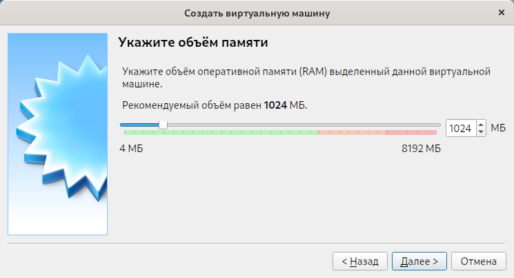

---
## Front matter
lang: ru-RU
title: Отчёт по лабораторной работе 1
author: 'Дзугаева Лилия Владиславовна'

## Formatting
toc: false
slide_level: 2
theme: metropolis
mainfont: PT Serif 
romanfont: PT Serif
sansfont: PT Sans
monofont: PT Mono
header-includes: 
 - \metroset{progressbar=frametitle,sectionpage=progressbar,numbering=fraction}
 - '\makeatletter'
 - '\beamer@ignorenonframefalse'
 - '\makeatother'
aspectratio: 43
section-titles: true
---

## Цель работы

Приобретение практических навыков установки операционной системы на виртуальную машину, настройки минимально необходимых для дальнейшей работы сервисов.

## Задание

Лабораторная работа подразумевает установку на виртуальную машину VirtualBox  операционной системы Linux, дистрибутив Centos.

# Выполнение лабораторной работы

1. Запускаю _Virtual Box_, создаю новую виртуальную машину с именем **_Base Dzugaeva_**: выбираю тип операционной системы _Linux_, а также версию _Red Hat_ (рис.1).

   { #fig:001 width=50% }

---

2. Указываю объем памяти 1024 МБ (рис.2).

   { #fig:002 width=50% }

---

3. Задаю конфигурацию жесткого диска: создаю новый динамический виртуальный жёсткий диск типа VDI, а также размер диска - 40 ГБ и его расположение (рис.3-6).

   { #fig:003 width=50% }

----

   { #fig:004 width=50% }

---

   { #fig:005 width=50% }

---

   { #fig:006 width=50% }

---

4. Добавляю во вкладке _"Носители"_ свойств виртулальной машины новый привод оптических дисков, выбираю нужный образ для установки операционной системы (рис.7).

   { #fig:007 width=50% }
   
---

5. Запускаю созданную виртуальную машину и начинаю установку. В открытом окне выбираю русский язык как язык интерфейса, а также добавляю русскую раскладку клавиатуры (рис.8).

   { #fig:008 width=50% }

---

   { #fig:009 width=50% }

---

7. Продолжаю установку операционной системы, перезагружаю виртуальную машину по требованию установщика. Принимаю лицензионное соглашение. Вхожу в созданный ранее профиль, открывается привычный графический интерфейс. (рис.10).

   { #fig:010 width=50% }

# Выводы

Приобрел практические навыков установки операционной системы на виртуальную машину, настройки минимально необходимых для дальнейшей работы сервисов.

## {.standout}

Спасибо за внимание
